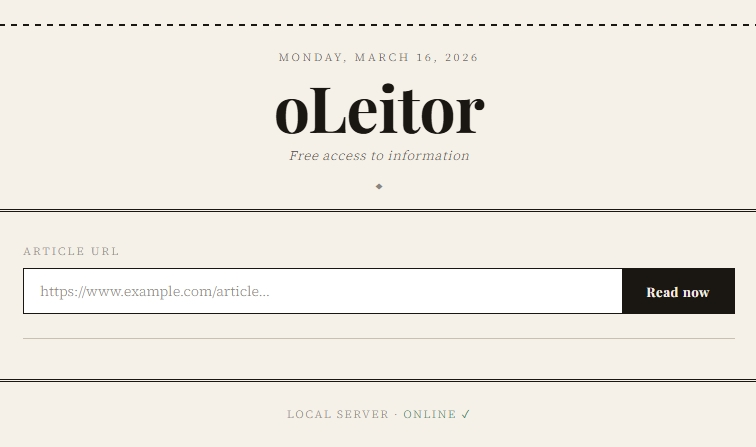

# oLeitor

A minimal, newspaper-style web reader that bypasses paywalls and extracts clean article text from any URL.  
Paste a link → get the full article, ad-free, ready to read or save as PDF.



## Features

The front-end (`index.html`) sends the article URL to a local Flask server (`server.py`), which tries several extraction strategies in sequence until it gets usable content:

| # | Method | Description |
|---|--------|-------------|
| 1 | **Direct access** | Fetches the page directly with a robust browser-like User-Agent |
| 2 | **newspaper3k** | Uses the `newspaper3k` library for smart article parsing |
| 3 | **Wayback Machine** | Falls back to the most recent Internet Archive snapshot |
| 4 | **archive.ph** | Uses the archive mirror (replaced discontinued Google Cache) |
| 5 | **12ft.io** | Uses the 12ft.io proxy as a last resort |

- **Distraction-free Reading**: Extracted text is rendered in a clean, typographic layout.
- **PDF Export**: A **Download PDF** button triggers the browser's print dialog for offline saving.
- **Dark Mode**: UI automatically shifts to a dark theme depending on your OS preferences.
- **Local Network Support**: Run Flask on `0.0.0.0` and read from any device on the same Wi-Fi flawlessly.

## Requirements

- Python 3.8+
- The packages listed in `requirements.txt`

## Installation

```bash
# 1. Clone the repository
git clone https://github.com/your-username/oLeitor.git
cd oLeitor

# 2. (Optional) Create a virtual environment
python -m venv .venv
# Windows
.venv\Scripts\activate
# macOS/Linux
source .venv/bin/activate

# 3. Install dependencies
pip install -r requirements.txt
```

## Usage

### Windows

Double-click `open_oLeitor.bat`.  
It starts the server and opens `http://localhost:5000` in your default browser automatically.


### Linux

Execution permission: `chmod +x open_oLeitor.sh`
Double-click `open_oLeitor.sh`.  
It starts the server and opens `http://localhost:5000` in your default browser automatically.


### Any OS

```bash
python server.py
```

Then open **http://localhost:5000** in your browser.

## Project structure

```
oLeitor/
├── index.html          # Front-end UI
├── server.py           # Flask back-end / extraction engine
├── open_oLeitor.bat    # One-click launcher (Windows)
├── requirements.txt    # Python dependencies
└── .gitignore
```

## License

MIT — free to use, modify, and distribute.
